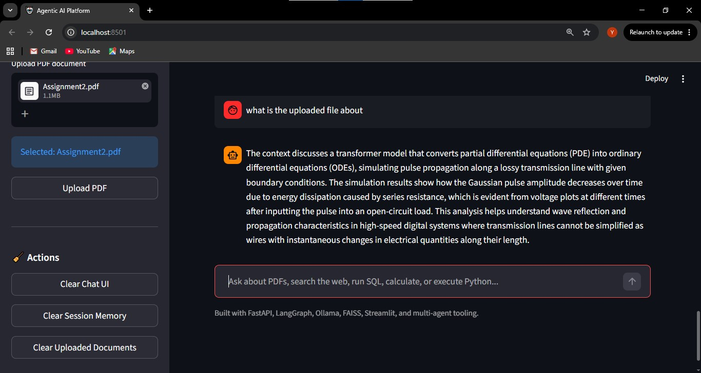
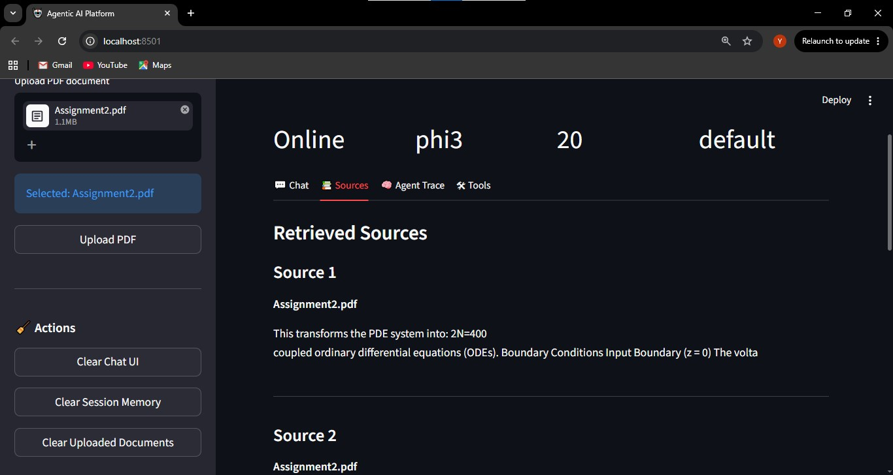
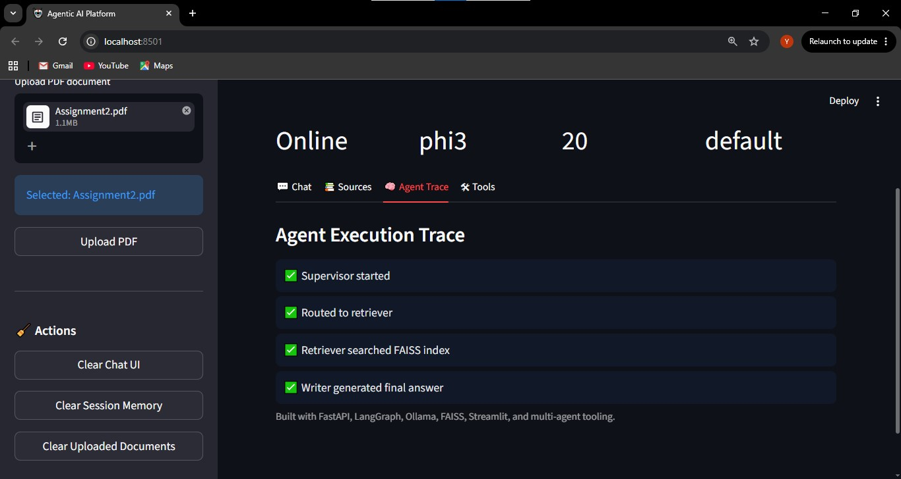
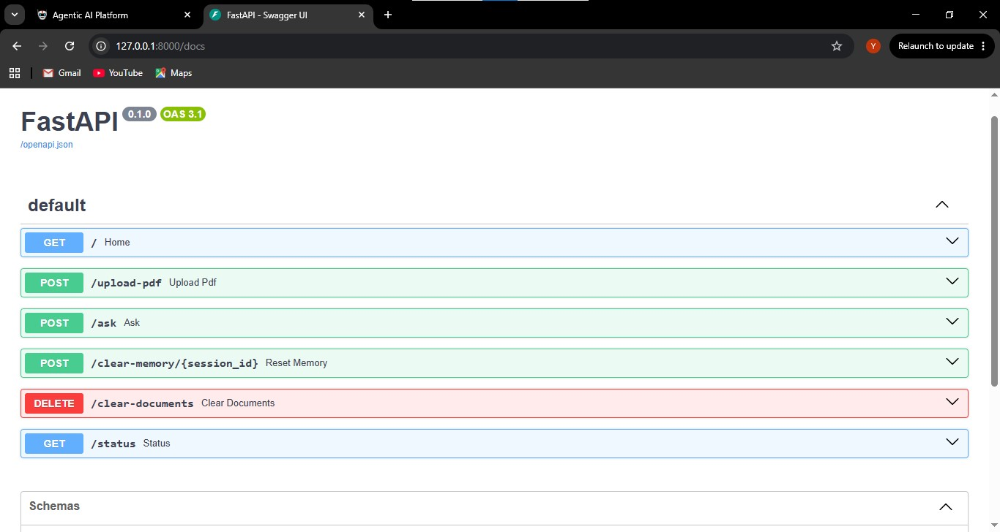

## Project Description

Agentic AI Platform is a full-stack multi-agent artificial intelligence system designed to combine Retrieval-Augmented Generation (RAG), tool-augmented reasoning, persistent memory, web search, SQL querying, and Python code execution into a unified intelligent assistant platform.

The system uses a LangGraph-based workflow to route user requests between specialized agents and tools depending on the task being performed. Users can upload PDF documents for semantic retrieval and question answering, execute Python snippets, perform mathematical calculations, query SQL databases, search the web for current information, and maintain contextual conversations through session-based memory.

The backend is built with FastAPI and integrates Ollama-hosted Large Language Models (LLMs), FAISS vector databases, HuggingFace embeddings, SQLite, and multiple custom tools. The frontend is built with Streamlit and provides an interactive chat interface with source tracking, agent trace visualization, document upload, and real-time system monitoring.

This project demonstrates practical implementation of:

- Multi-agent AI systems
- Retrieval-Augmented Generation (RAG)
- Tool calling and orchestration
- LLM integration
- Semantic search
- Persistent conversational memory
- Full-stack AI application development
- AI workflow routing with LangGraph
- Production-style backend/frontend architecture

## Features

- Multi-agent workflow
- PDF RAG
- Web search
- SQL querying
- Python execution
- Session memory
- Agent trace
- Streamlit frontend
- FastAPI backend

---

## Architecture

Explain:

- FastAPI backend
- LangGraph workflow
- FAISS vector DB
- Ollama LLM
- Streamlit frontend

You can later add an architecture diagram image.

---

## Tech Stack

### Backend

- FastAPI
- LangGraph
- LangChain
- Ollama
- FAISS
- SQLite

### Frontend

- Streamlit

### AI/ML

- sentence-transformers
- HuggingFace embeddings

---

## Project Structure

```text
AGENTIC_AI_SYSTEM/
├── backend/
├── frontend/
├── screenshots/
├── README.md
└── .gitignore
```

---

## Screenshots

### Streamlit Chat Interface



---

### Sources Panel



---

### Agent Trace



---

### FastAPI Swagger Docs



# Agentic AI Platform

---

## Installation

### Clone repository

```bash
git clone https://github.com/YOUR_USERNAME/agentic-ai-platform.git
```

### Backend setup

```bash
cd backend
python -m venv venv
venv\Scripts\activate
pip install -r requirements.txt
```

### Start backend

```bash
uvicorn app.main:app --reload
```

### Start frontend

```bash
cd frontend
streamlit run app.py
```

---

## Environment Variables

Create `.env`

```env
MODEL_NAME=phi3
DATA_DIR=data
INDEX_DIR=faiss_index
DB_PATH=database/company.db
MEMORY_FILE=app/memory_store.json
```

---

## API Endpoints

| Endpoint                     | Method | Description              |
| ---------------------------- | ------ | ------------------------ |
| `/ask`                       | POST   | Main AI endpoint         |
| `/upload-pdf`                | POST   | Upload PDF               |
| `/status`                    | GET    | Backend status           |
| `/clear-memory/{session_id}` | POST   | Clear session memory     |
| `/clear-documents`           | DELETE | Remove indexed documents |

---

## Tools

### Calculator Tool

Performs arithmetic calculations.

### Python Tool

Executes Python snippets.

### SQL Tool

Queries SQLite database.

### Web Search Tool

Searches the internet.

### PDF RAG

Answers questions from uploaded PDFs.

---

## Example Queries

```text
80 + 20
```

```text
python for i in range(5): print(i)
```

```text
show me all employees
```

```text
search latest AI news
```

```text
what is the uploaded document about
```

---

## Future Improvements

- Multi-document RAG
- Better web search APIs
- Authentication
- Docker deployment
- Cloud deployment
- Voice support
- Multi-modal support

---

## Author

Yerimah Emmanuel Ogenahotse

GitHub:
https://github.com/YerimahOfTimes
